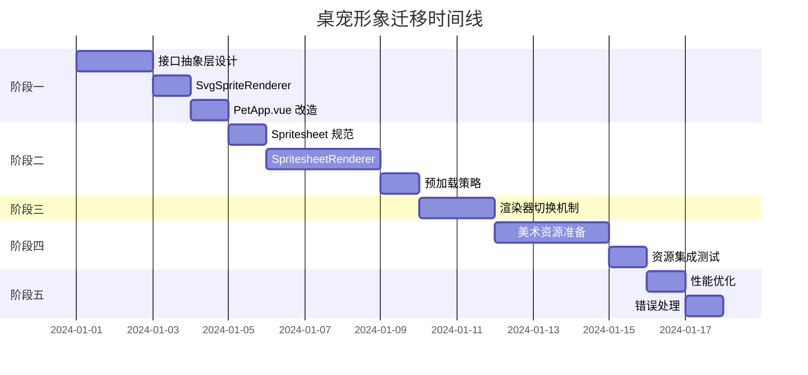

# 桌宠形象渐进式迁移方案

## 一、现状分析

### 1.1 当前实现
- **位置**: [`pet/components/PetApp.vue`](pet/components/PetApp.vue:31)
- **技术栈**: 内联 SVG + Vue computed + CSS @keyframes
- **尺寸**: 120x110px SVG
- **状态**: 8种 (idle|walk|drag|react|think|talk|sleep|remind)
- **心情**: 4种 (happy|annoyed|dizzy|purring)

### 1.2 当前动画机制
```javascript
// 帧驱动 - 220ms 间隔
const frameIdx = ref(0)
timers.tick = setInterval(() => { frameIdx.value++ }, 220)

// 动态尾巴路径
const tailPath = computed(() => {
  const w = Math.sin(frameIdx.value * 0.9) * 12
  return `M92 84 q20 ${-8 + w} ${16 + w * 0.4} -26`
})

// 眨眼控制
const eyesClosed = computed(() => {
  if (state.value === 'sleep') return true
  return frameIdx.value % 8 === 6
})
```

### 1.3 当前动画映射表
| 状态/心情 | 动画效果 | CSS 类 |
|-----------|----------|--------|
| idle | 呼吸 | breathe |
| walk | 上下弹跳 | bob |
| react | 弹跳 | bounce |
| remind | 摇摆 | wiggle |
| talk | 弹跳 | bob |
| think | 呼吸 | breathe |
| sleep | 慢呼吸 | breathe |
| happy | 呼噜 | purr |
| annoyed | 摇晃 | shake |
| dizzy | 旋转 | sway |

---

## 二、迁移目标

### 2.1 核心目标
1. **解耦**: 美术资源与业务逻辑完全分离
2. **可扩展**: 支持多角色、多皮肤切换
3. **高性能**: 帧动画流畅，内存占用合理
4. **向后兼容**: 现有功能不受影响

### 2.2 非目标
- 不改变现有交互逻辑
- 不改变窗口尺寸和布局
- 不改变状态机和事件处理

---

## 三、渐进式迁移方案

### 阶段一：接口抽象层（预计 2-3 天）

#### 3.1.1 设计目标
将当前 SVG 渲染逻辑封装为独立组件，定义统一的动画控制接口。

#### 3.1.2 接口定义

```typescript
// pet/components/sprite/types.ts
export interface SpriteRenderer {
  // 状态控制
  setState(state: PetState): void
  setMood(mood: PetMood): void
  
  // 动画控制
  play(): void
  pause(): void
  resume(): void
  
  // 方向控制
  setFacing(left: boolean): void
  
  // 生命周期
  mount(el: HTMLElement): void
  unmount(): void
}

export type PetState = 'idle' | 'walk' | 'drag' | 'react' | 'think' | 'talk' | 'sleep' | 'remind'
export type PetMood = '' | 'happy' | 'annoyed' | 'dizzy' | 'purring'

export interface SpriteConfig {
  width: number
  height: number
  frameRate: number
}
```

#### 3.1.3 创建 SvgSpriteRenderer

```vue
<!-- pet/components/sprite/SvgSpriteRenderer.vue -->
<template>
  <svg :viewBox="`0 0 ${config.width} ${config.height}`" 
       :width="config.width" 
       :height="config.height">
    <!-- 迁移现有 SVG 内容 -->
    <path :d="tailPath" fill="none" stroke="#334155" stroke-width="8" stroke-linecap="round"/>
    <!-- ... 其他元素 ... -->
  </svg>
</template>

<script setup>
import { ref, computed, watch, onMounted, onBeforeUnmount } from 'vue'

const props = defineProps({
  state: String,
  mood: String,
  facingLeft: Boolean,
  frameIdx: Number
})

const config = { width: 120, height: 110, frameRate: 220 }

// 迁移现有 computed 逻辑
const tailPath = computed(() => {
  const w = Math.sin(props.frameIdx * 0.9) * 12
  return `M92 84 q20 ${-8 + w} ${16 + w * 0.4} -26`
})

const eyesClosed = computed(() => {
  if (props.state === 'sleep') return true
  return props.frameIdx % 8 === 6
})

// 暴露接口
defineExpose({
  play: () => { /* 实现 */ },
  pause: () => { /* 实现 */ },
  resume: () => { /* 实现 */ }
})
</script>
```

#### 3.1.4 修改 PetApp.vue

```vue
<!-- 替换内联 SVG 为组件引用 -->
<div ref="spriteRef" class="pet-sprite" :class="[state, { flip: facingLeft }]">
  <SvgSpriteRenderer 
    ref="spriteRenderer"
    :state="state"
    :mood="mood"
    :facing-left="facingLeft"
    :frame-idx="frameIdx"
  />
</div>
```

#### 3.1.5 验收标准
- [ ] 所有现有动画效果保持不变
- [ ] 状态切换正常
- [ ] 心情切换正常
- [ ] 拖动、点击、滚轮交互正常
- [ ] 无视觉回归

---

### 阶段二：Spritesheet 渲染器实现（预计 3-4 天）

#### 3.2.1 设计目标
实现基于 spritesheet 的渲染器，遵循阶段一定义的接口。

#### 3.2.2 Spritesheet 规范

**图片规格：**
- 单帧尺寸：120x110px（与现有 SVG 一致）
- 排列方式：水平排列
- 文件格式：PNG（支持透明通道）
- 命名规范：`{state}_{mood}.png`

**示例：**
```
idle.png          -> 8帧 x 120px = 960px 宽
idle_happy.png    -> 8帧 x 120px = 960px 宽
walk.png          -> 12帧 x 120px = 1440px 宽
walk_happy.png    -> 12帧 x 120px = 1440px 宽
```

#### 3.2.3 动画配置

```json
// assets/sprites/cat/config.json
{
  "version": "1.0",
  "frameWidth": 120,
  "frameHeight": 110,
  "animations": {
    "idle": {
      "frames": 8,
      "fps": 4,
      "loop": true
    },
    "idle_happy": {
      "frames": 8,
      "fps": 6,
      "loop": true
    },
    "walk": {
      "frames": 12,
      "fps": 12,
      "loop": true
    },
    "walk_happy": {
      "frames": 12,
      "fps": 12,
      "loop": true
    },
    "react": {
      "frames": 6,
      "fps": 10,
      "loop": false
    },
    "sleep": {
      "frames": 4,
      "fps": 2,
      "loop": true
    },
    "talk": {
      "frames": 8,
      "fps": 8,
      "loop": true
    },
    "think": {
      "frames": 6,
      "fps": 3,
      "loop": true
    },
    "remind": {
      "frames": 8,
      "fps": 8,
      "loop": true
    },
    "annoyed": {
      "frames": 6,
      "fps": 8,
      "loop": false
    },
    "dizzy": {
      "frames": 8,
      "fps": 10,
      "loop": true
    },
    "purring": {
      "frames": 8,
      "fps": 6,
      "loop": true
    }
  }
}
```

#### 3.2.4 创建 SpritesheetRenderer

```vue
<!-- pet/components/sprite/SpritesheetRenderer.vue -->
<template>
  <div class="sprite-container" :style="containerStyle">
    <canvas ref="canvasRef" :width="config.frameWidth" :height="config.frameHeight"></canvas>
  </div>
</template>

<script setup>
import { ref, computed, watch, onMounted, onBeforeUnmount } from 'vue'
import spriteConfig from '../../../assets/sprites/cat/config.json'

const props = defineProps({
  state: String,
  mood: String,
  facingLeft: Boolean
})

const config = ref(spriteConfig)
const canvasRef = ref(null)
const currentAnimation = ref('idle')
const currentFrame = ref(0)
const isPlaying = ref(true)

// 图片缓存
const imageCache = new Map()
let animationTimer = null

// 计算当前动画名称
const animationName = computed(() => {
  const base = props.state
  const moodSuffix = props.mood ? `_${props.mood}` : ''
  const withMood = `${base}${moodSuffix}`
  
  // 优先使用带心情的动画，否则使用基础动画
  if (config.value.animations[withMood]) {
    return withMood
  }
  return base
})

// 容器样式（支持翻转）
const containerStyle = computed(() => ({
  width: `${config.value.frameWidth}px`,
  height: `${config.value.frameHeight}px`,
  transform: props.facingLeft ? 'scaleX(-1)' : 'scaleX(1)'
}))

// 加载图片
async function loadImage(name) {
  if (imageCache.has(name)) {
    return imageCache.get(name)
  }
  
  return new Promise((resolve, reject) => {
    const img = new Image()
    img.onload = () => {
      imageCache.set(name, img)
      resolve(img)
    }
    img.onerror = reject
    img.src = `assets/sprites/cat/${name}.png`
  })
}

// 渲染帧
function renderFrame() {
  const canvas = canvasRef.value
  if (!canvas) return
  
  const ctx = canvas.getContext('2d')
  const animName = animationName.value
  const animConfig = config.value.animations[animName]
  
  if (!animConfig) {
    console.warn(`Unknown animation: ${animName}`)
    return
  }
  
  loadImage(animName).then(img => {
    const frameWidth = config.value.frameWidth
    const frameHeight = config.value.frameHeight
    const frame = currentFrame.value % animConfig.frames
    
    // 清除画布
    ctx.clearRect(0, 0, frameWidth, frameHeight)
    
    // 绘制当前帧
    ctx.drawImage(
      img,
      frame * frameWidth, 0,  // 源位置
      frameWidth, frameHeight, // 源尺寸
      0, 0,                    // 目标位置
      frameWidth, frameHeight  // 目标尺寸
    )
  })
}

// 启动动画
function startAnimation() {
  stopAnimation()
  
  const animConfig = config.value.animations[animationName.value]
  if (!animConfig) return
  
  const interval = 1000 / animConfig.fps
  
  animationTimer = setInterval(() => {
    if (!isPlaying.value) return
    
    currentFrame.value++
    
    // 非循环动画到达最后一帧时停止
    if (!animConfig.loop && currentFrame.value >= animConfig.frames) {
      currentFrame.value = animConfig.frames - 1
      stopAnimation()
    }
    
    renderFrame()
  }, interval)
}

// 停止动画
function stopAnimation() {
  if (animationTimer) {
    clearInterval(animationTimer)
    animationTimer = null
  }
}

// 重置帧
function resetFrame() {
  currentFrame.value = 0
}

// 监听动画变化
watch(animationName, () => {
  resetFrame()
  startAnimation()
})

// 生命周期
onMounted(() => {
  startAnimation()
})

onBeforeUnmount(() => {
  stopAnimation()
  imageCache.clear()
})

// 暴露接口
defineExpose({
  play: () => { isPlaying.value = true; startAnimation() },
  pause: () => { isPlaying.value = false; stopAnimation() },
  resume: () => { isPlaying.value = true; startAnimation() },
  resetFrame
})
</script>

<style scoped>
.sprite-container {
  position: relative;
  display: inline-block;
}
</style>
```

#### 3.2.5 预加载策略

```javascript
// pet/components/sprite/useSpritePreload.js
import { onMounted } from 'vue'
import spriteConfig from '../../../assets/sprites/cat/config.json'

export function useSpritePreload() {
  const preloadImages = async () => {
    const animations = Object.keys(spriteConfig.animations)
    
    const promises = animations.map(name => {
      return new Promise((resolve, reject) => {
        const img = new Image()
        img.onload = resolve
        img.onerror = reject
        img.src = `assets/sprites/cat/${name}.png`
      })
    })
    
    try {
      await Promise.all(promises)
      console.log('All sprites preloaded')
    } catch (err) {
      console.error('Failed to preload sprites:', err)
    }
  }
  
  return { preloadImages }
}
```

#### 3.2.6 验收标准
- [ ] Canvas 渲染流畅
- [ ] 帧率稳定
- [ ] 内存占用合理（图片缓存）
- [ ] 支持所有状态和心情组合
- [ ] 支持方向翻转
- [ ] 非循环动画正确停止

---

### 阶段三：渲染器切换机制（预计 1-2 天）

#### 3.3.1 设计目标
支持在运行时切换 SVG 和 Spritesheet 渲染器，便于测试和渐进上线。

#### 3.3.2 配置驱动

```javascript
// pet/components/sprite/config.js
export const SPRITE_RENDERER_TYPE = {
  SVG: 'svg',
  SPRITESHEET: 'spritesheet'
}

// 可通过环境变量或配置中心控制
export const CURRENT_RENDERER = import.meta.env.VITE_SPRITE_RENDERER || SPRITE_RENDERER_TYPE.SVG
```

#### 3.3.3 动态组件

```vue
<!-- pet/components/sprite/PetSprite.vue -->
<template>
  <component 
    :is="rendererComponent"
    ref="renderer"
    :state="state"
    :mood="mood"
    :facing-left="facingLeft"
    :frame-idx="frameIdx"
  />
</template>

<script setup>
import { computed, ref } from 'vue'
import SvgSpriteRenderer from './SvgSpriteRenderer.vue'
import SpritesheetRenderer from './SpritesheetRenderer.vue'
import { CURRENT_RENDERER, SPRITE_RENDERER_TYPE } from './config'

const props = defineProps({
  state: String,
  mood: String,
  facingLeft: Boolean,
  frameIdx: Number
})

const rendererComponent = computed(() => {
  return CURRENT_RENDERER === SPRITE_RENDERER_TYPE.SPRITESHEET
    ? SpritesheetRenderer
    : SvgSpriteRenderer
})

const renderer = ref(null)

// 透传接口
defineExpose({
  play: () => renderer.value?.play(),
  pause: () => renderer.value?.pause(),
  resume: () => renderer.value?.resume()
})
</script>
```

#### 3.3.4 验收标准
- [ ] 可通过配置切换渲染器
- [ ] 切换后功能正常
- [ ] 无内存泄漏

---

### 阶段四：资源准备与替换（预计 2-3 天）

#### 3.4.1 美术资源需求清单

| 动画名称 | 帧数 | 说明 | 优先级 |
|----------|------|------|--------|
| idle | 8 | 默认站立 | P0 |
| idle_happy | 8 | 开心站立 | P0 |
| idle_annoyed | 6 | 不满站立 | P0 |
| idle_dizzy | 8 | 头晕站立 | P0 |
| idle_purring | 8 | 享受站立 | P0 |
| walk | 12 | 行走 | P0 |
| walk_happy | 12 | 开心行走 | P1 |
| react | 6 | 点击反应 | P0 |
| sleep | 4 | 睡眠 | P0 |
| talk | 8 | 说话 | P0 |
| think | 6 | 思考 | P0 |
| remind | 8 | 提醒 | P1 |

**总计：12 个 spritesheet 文件**

#### 3.4.2 美术规范文档

```markdown
## 桌宠美术资源规范

### 基础规格
- 单帧尺寸：120 x 110 px
- 背景：透明（PNG）
- 排列：水平排列，无间距
- 命名：{state}_{mood}.png

### 风格要求
- 保持现有 SVG 的灰色猫咪风格
- 线条清晰，边缘锐利
- 颜色参考：
  - 主体：#64748b
  - 耳朵内侧：#f9a8d4
  - 眼睛：#1e293b
  - 胡须：#1e293b

### 动画要求
- idle：轻微呼吸起伏，尾巴摆动
- walk：四足交替，身体轻微上下浮动
- react：弹跳或摇晃
- sleep：闭眼，呼吸缓慢
- talk：嘴巴开合
- think：头部微倾，问号浮动
```

#### 3.4.3 临时测试资源

在正式美术资源完成前，可使用以下方法生成测试资源：

```bash
# 使用 ImageMagick 生成占位图
# 为每个动画生成纯色占位帧
magick -size 120x110 xc:none -fill "#64748b" -draw "circle 60,55 60,20" idle_0.png
# ... 重复生成所有帧并拼接
```

或使用在线工具生成简单 spritesheet 进行测试。

#### 3.4.4 验收标准
- [ ] 所有动画资源准备完成
- [ ] 资源符合规范
- [ ] 加载无报错
- [ ] 视觉效果符合预期

---

### 阶段五：优化与收尾（预计 1-2 天）

#### 3.5.1 性能优化

**图片压缩：**
```bash
# 使用 pngquant 压缩
pngquant --quality=65-80 --speed 1 assets/sprites/cat/*.png
```

**懒加载：**
```javascript
// 非关键动画延迟加载
const lazyAnimations = ['remind', 'walk_happy']

function loadAnimationOnDemand(name) {
  if (lazyAnimations.includes(name)) {
    loadImage(name)
  }
}
```

#### 3.5.2 错误处理

```javascript
// 加载失败时降级到 SVG
watch(imageLoadError, (hasError) => {
  if (hasError) {
    console.warn('Spritesheet load failed, falling back to SVG')
    CURRENT_RENDERER = SPRITE_RENDERER_TYPE.SVG
  }
})
```

#### 3.5.3 验收标准
- [ ] 内存占用 < 50MB
- [ ] 帧率稳定 60fps
- [ ] 加载时间 < 2s
- [ ] 错误降级正常

---

## 四、风险与应对

| 风险 | 影响 | 应对措施 |
|------|------|----------|
| 美术资源延期 | 阶段四阻塞 | 使用占位图先行开发 |
| Spritesheet 加载慢 | 首屏体验差 | 预加载 + 骨架屏 |
| 内存占用过高 | 应用卡顿 | 图片压缩 + 懒加载 |
| 动画效果不一致 | 视觉回归 | 保留 SVG 作为 fallback |

---

## 五、时间线



---

## 六、文件结构

```
pet/
├── components/
│   ├── PetApp.vue                    # 主组件（修改）
│   └── sprite/                       # 新增目录
│       ├── PetSprite.vue             # 统一入口组件
│       ├── SvgSpriteRenderer.vue     # SVG 渲染器
│       ├── SpritesheetRenderer.vue   # Spritesheet 渲染器
│       ├── config.js                 # 配置
│       ├── types.ts                  # 类型定义
│       └── useSpritePreload.js       # 预加载 hook
└── pet-main.js

assets/
└── sprites/
    └── cat/
        ├── config.json               # 动画配置
        ├── idle.png
        ├── idle_happy.png
        ├── idle_annoyed.png
        ├── idle_dizzy.png
        ├── idle_purring.png
        ├── walk.png
        ├── walk_happy.png
        ├── react.png
        ├── sleep.png
        ├── talk.png
        ├── think.png
        └── remind.png
```

---

## 七、测试计划

### 7.1 单元测试
- 接口定义正确性
- 帧计算逻辑
- 图片加载逻辑

### 7.2 集成测试
- 状态切换流畅性
- 心情切换流畅性
- 渲染器切换

### 7.3 视觉回归测试
- 截图对比 SVG 和 Spritesheet 效果
- 关键帧对比

### 7.4 性能测试
- 内存占用监控
- 帧率监控
- 加载时间测量

---

## 八、后续扩展

### 8.1 多角色支持
```javascript
// 通过配置切换角色
const CURRENT_CHARACTER = 'cat' // 可扩展为 'dog', 'bird' 等

const rendererComponent = computed(() => {
  return `${CURRENT_CHARACTER}-${CURRENT_RENDERER}`
})
```

### 8.2 皮肤系统
```javascript
// 支持同一角色的不同皮肤
const CURRENT_SKIN = 'default' // 可扩展为 'christmas', 'halloween' 等

const spritePath = computed(() => {
  return `assets/sprites/${CURRENT_CHARACTER}/${CURRENT_SKIN}/${animationName}.png`
})
```

### 8.3 用户自定义
- 支持用户上传自定义 spritesheet
- 提供 spritesheet 编辑器

---

## 九、总结

本方案采用渐进式迁移策略，分五个阶段完成桌宠形象从 SVG 到 Spritesheet 的替换：

1. **接口抽象层**：封装现有逻辑，定义统一接口
2. **Spritesheet 渲染器**：实现新的渲染后端
3. **渲染器切换**：支持运行时切换，降低风险
4. **资源替换**：准备美术资源并集成
5. **优化收尾**：性能优化和错误处理

该方案确保：
- ✅ 现有功能不受影响
- ✅ 可随时回退到 SVG 版本
- ✅ 支持渐进上线
- ✅ 易于后续扩展
