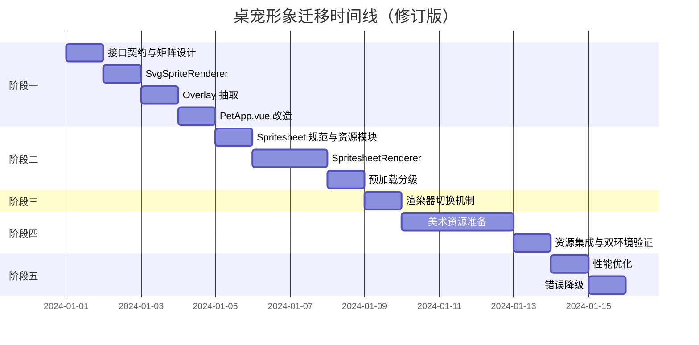

# 桌宠形象渐进式迁移方案（修订版 v2）

> **修订记录（v2，审查后修订）**
> 本版针对 v1 审查中发现的硬伤与质量问题做了全面修订，主要变更：
> 1. **资源路径**：sprites 改为 **Vite 模块资源**（`import.meta.glob + ?url`），废弃手写相对路径（v1 在 dev `localhost:5173/pet/pet.html` 与 prod `loadFile(dist/pet/pet.html)` 双环境均会 404）。
> 2. **切换机制**：渲染器选择改为**响应式 `ref`**，支持运行时切换与错误降级（v1 的模块级 `const` 不允许重新赋值且不响应式）。
> 3. **接口契约**：定稿为**声明式 props + `complete` 事件**，删除 v1 中无人调用的命令式 `setState/setMood/mount/unmount`。
> 4. **帧时钟**：统一由**渲染器内部 rAF + 时间戳**驱动，PetApp 移除 `frameIdx/timers.tick`，消除双轨计时。
> 5. **动画矩阵**：新增 `useSpriteAnim` 显式 (state×mood)→animationName 矩阵，解决 `drag` 无帧、mood 覆盖优先级与现 CSS 不一致的问题。
> 6. **Overlay 层**：新增 `SpriteOverlay`，承接 `?` / `z z z` / `喵~` / `♥` 等运行时元素，spritesheet 下不丢失。
> 7. **渲染路线**：阶段二改为 **CSS background-position 逐帧**（GPU 合成、零 JS 绘制、原生支持高分屏），替代 Canvas drawImage。
> 8. **验收/风险/测试**：对准真实风险（加载延迟、首帧、404 降级、动画完成事件、状态高速切换竞态）。

---

## 一、现状分析

### 1.1 当前实现
- **位置**: [`pet/components/PetApp.vue`](pet/components/PetApp.vue:31)
- **技术栈**: 内联 SVG + Vue computed + CSS @keyframes
- **尺寸**: 120x110px SVG
- **状态**: 8种 (idle|walk|drag|react|think|talk|sleep|remind)
- **心情**: 4种 (happy|annoyed|dizzy|purring)

### 1.2 当前动画机制
```javascript
// 帧驱动 - 220ms 间隔（将被移除，改为渲染器内部 rAF）
const frameIdx = ref(0)
timers.tick = setInterval(() => { frameIdx.value++ }, 220)

// 动态尾巴路径
const tailPath = computed(() => {
  const w = Math.sin(frameIdx.value * 0.9) * 12
  return `M92 84 q20 ${-8 + w} ${16 + w * 0.4} -26`
})

// 眨眼控制
const eyesClosed = computed(() => {
  if (state.value === 'sleep') return true
  return frameIdx.value % 8 === 6
})
```

### 1.3 当前动画映射表（CSS 层叠，mood 类后定义故**覆盖** state 类）
| 状态/心情 | 动画效果 | CSS 类 |
|-----------|----------|--------|
| idle | 呼吸 | breathe |
| walk | 上下弹跳 | bob |
| drag | 无动画 | - |
| react | 弹跳 | bounce |
| remind | 摇摆 | wiggle |
| talk | 弹跳 | bob |
| think | 呼吸 | breathe |
| sleep | 慢呼吸 | breathe |
| happy | 呼噜 | purr |
| annoyed | 摇晃 | shake |
| dizzy | 旋转 | sway |
| purring | 呼噜 | purr |

> 注意：由于 `.happy/.annoyed/.dizzy` 类在样式表中位于 state 类之后，**心情动画在 CSS 层叠中优先于状态动画**（例如 `sleep + happy` 实际显示 happy 动画）。动画矩阵必须复现这一语义（见 3.5）。

---

## 二、迁移目标

### 2.1 核心目标
1. **解耦**: 美术资源与业务逻辑完全分离
2. **可扩展**: 支持多角色、多皮肤切换
3. **高性能**: 帧动画流畅（GPU 合成），内存占用合理
4. **向后兼容**: 现有功能不受影响，可随时回退到 SVG

### 2.2 非目标
- 不改变现有交互逻辑
- 不改变窗口尺寸和布局
- 不改变状态机和事件处理

---

## 三、关键技术决策（v2 新增，先读此节再读各阶段）

### 3.1 资源管理与路径（解决 v1 P0-1）
桌宠是 Vite 多页入口（`vite.config.js` 已含 `pet: './pet/pet.html'`，`base: './'`），
但项目根 `assets/` 仅供 electron-builder 打包图标，**不能**作为运行时 sprites 来源。
v1 的手写相对路径 `assets/sprites/...` 在 dev / prod 双环境都会 404。

**决策：sprites 作为 Vite 模块资源引入，路径完全交由 Vite 解析：**
- 资源目录：`pet/assets/sprites/cat/`（页级私有，与打包用根 `assets/` 隔离）
- 渲染器用 `import.meta.glob` 一次性注册全部 spritesheet，URL 由 Vite 产出（带 hash、相对 `base` 正确解析），dev 与 `loadFile` 均可用。
- config.json 用 ES import 引入（Vite 原生支持 JSON）。

> ⚠️ 不要用 `publicDir + 绝对路径 /assets/...`：`base:'./'` 时绝对路径在 `file://` 下会解析到磁盘根目录。

### 3.2 渲染器切换为响应式（解决 v1 P0-2）
`import.meta.env.VITE_SPRITE_RENDERER` 是**构建期**常量，只能决定默认值；
运行时切换 / 错误降级必须走响应式状态。

### 3.3 接口契约：声明式 props + 事件（解决 v1 P0-3 / P1-7）
渲染器是**受控组件**，只声明式消费 PetApp 的状态，不接收命令式状态调用。

### 3.4 帧时钟：渲染器内部 rAF + 时间戳（解决 v1 P0-4 / P1-1）
- 统一由渲染器内部 `requestAnimationFrame` + `performance.now()` 按动画 `fps` 推进帧。
- PetApp 移除 `frameIdx` 与 `timers.tick`。
- rAF 在 Electron 窗口被遮挡时自动暂停 —— 桌宠不可见即无需动画，符合现状语义；恢复时用时间戳重算，无累计跳帧。

### 3.5 动画矩阵（解决 v1 P0-5）
由共享 `useSpriteAnim` 依据 (state, mood) 显式查表得到最终 `animationName`，**渲染器不做拼接/回退猜测**。
矩阵语义与现状 CSS 一致：**心情动画优先于状态动画**；`drag` 映射到 `idle`。

### 3.6 Overlay 层（解决 v1 P0-6）
SVG 中 `?` / `z z z` / `喵~` / `♥` 等运行时元素不属于角色本体动画，抽为 `SpriteOverlay`
独立于渲染器（SVG 与 spritesheet 共用），spritesheet 下不丢失。

### 3.7 渲染技术路线（v2 决策）
桌面成功基于 **CSS background-position 逐帧**：一个 `div` 定宽高 + `background-image`，
rAF 更新 `background-position`。优点：GPU 合成、零 JS 每帧绘制、原生高分屏支持，
最契合"纯整帧替换、无缩放/旋转/滤镜"的桌宠场景。**若未来需要帧内动效/滤镜，再引入 Canvas 层，接口不变。**

---

## 阶段一：接口抽象层（预计 2-3 天）

### 3.1.1 设计目标
将当前 SVG 渲染逻辑封装为独立组件，定义统一的动画控制接口与 Overlay 层。

### 3.1.2 接口定义（v2 修订：声明式 + 事件）
```typescript
// pet/components/sprite/types.ts
export type PetState = 'idle' | 'walk' | 'drag' | 'react' | 'think' | 'talk' | 'sleep' | 'remind'
export type PetMood = '' | 'happy' | 'annoyed' | 'dizzy' | 'purring'

// 渲染器对外契约：受控组件，仅消费状态 props，无命令式状态方法
export interface SpriteRendererProps {
  state: PetState
  mood: PetMood
  facingLeft: boolean
}

// 渲染器事件：
//   complete: 非循环动画（react 等）播放完成，由上层决定下一状态
export type SpriteRendererEmits = {
  complete: []
}

// 可选命令式接口（播放控制；状态切换一律走 props，不走命令式）
export interface SpriteRendererInstance {
  play(): void
  pause(): void
  resume(): void
  getCurrentFrame(): number
}
```
> v1 曾定义的 `setState/setMood/mount/unmount` 因与 Vue props 双轨冲突，已删除。
> `SpriteRendererInstance` 仅保留播放控制作为可选补充。

### 3.1.3 动画矩阵与状态解析（新增，解决 P0-5）
```javascript
// pet/components/sprite/useSpriteAnim.js
// 显式矩阵：行=状态，列=心情。语义与现状 CSS（mood 动画优先）保持一致。
// 值 = 最终 animationName（config.json 中必须存在该键，或渲染器回退到 'idle'）
const MATRIX = {
  idle:   { '': 'idle',        happy: 'idle_happy',   annoyed: 'idle_annoyed',  dizzy: 'idle_dizzy',   purring: 'idle_purring' },
  walk:   { '': 'walk',        happy: 'walk_happy',   annoyed: 'walk',          dizzy: 'walk',        purring: 'walk' },
  drag:   { '': 'idle',        happy: 'idle_happy',   annoyed: 'idle_annoyed',  dizzy: 'idle_dizzy',   purring: 'idle_purring' },
  react:  { '': 'react',       happy: 'react',        annoyed: 'react',         dizzy: 'react',       purring: 'react' },
  think:  { '': 'think',       happy: 'idle_happy',   annoyed: 'idle_annoyed',  dizzy: 'idle_dizzy',   purring: 'idle_purring' },
  talk:   { '': 'talk',        happy: 'talk',         annoyed: 'talk',          dizzy: 'talk',        purring: 'talk' },
  sleep:  { '': 'sleep',       happy: 'idle_happy',   annoyed: 'idle_annoyed',  dizzy: 'idle_dizzy',   purring: 'idle_purring' },
  remind: { '': 'remind',      happy: 'remind',       annoyed: 'remind',        dizzy: 'remind',      purring: 'remind' },
}

// 渲染器唯一入口：任何状态下都能得到确定性动画名（永不返回 undefined）
export function resolveAnimation(state, mood) {
  return MATRIX[state]?.[mood] ?? MATRIX[state]?.[''] ?? 'idle'
}
```

### 3.1.4 资源模块（新增，解决 P0-1）
```javascript
// pet/components/sprite/spriteAssets.js
// 资源以 Vite 模块引入：dev(localhost:5173) 与 prod(loadFile dist/pet/pet.html)
// 均由 Vite 产出可正确解析的 URL（带 hash、相对 base './'）。
import spriteConfig from '../../assets/sprites/cat/config.json'

// query:'?url' 使 glob 返回 URL 字符串而非内联内容；eager 在模块初始化时完成注册
const spriteUrls = import.meta.glob('../../assets/sprites/cat/*.png', {
  query: '?url',
  import: 'default',
  eager: true
})
// 形如: { '../../assets/sprites/cat/idle.png': '/assets/idle.abc123.png', ... }

export { spriteConfig }
export function getSpriteUrl(name, fallback = 'idle') {
  return spriteUrls[`../../assets/sprites/cat/${name}.png`]
    ?? spriteUrls[`../../assets/sprites/cat/${fallback}.png`]
}
```

### 3.1.5 Overlay 组件（新增，解决 P0-6）
```vue
<!-- pet/components/sprite/SpriteOverlay.vue -->
<template>
  <div class="sprite-overlay" aria-hidden="true">
    <span v-if="state === 'think'" class="ov ov-q">?</span>
    <span v-if="state === 'sleep'" class="ov ov-z">z z z</span>
    <span v-if="longPressing && mood !== 'purring'" class="ov ov-meow">喵~</span>
    <span v-if="mood === 'purring'" class="ov ov-heart">♥</span>
  </div>
</template>

<script setup>
// 坐标继承原 SVG 内文字位置（相对 120x110 视口）：
// ? -> left:90 top:0；z z z -> left:86 top:4；喵~ -> left:50 top:-2；♥ -> left:88 top:16
defineProps({
  state: { type: String, default: 'idle' },
  mood: { type: String, default: '' },
  longPressing: { type: Boolean, default: false }
})
</script>

<style scoped>
.sprite-overlay { position: absolute; inset: 0; pointer-events: none; font-weight: 700; }
.ov { position: absolute; animation: floatq 1.2s ease-in-out infinite; }
.ov-q   { left: 90px; top: 0;   font-size: 16px; color: #a5b4fc; }
.ov-z   { left: 86px; top: 4px; font-size: 13px; color: #94a3b8; }
.ov-meow{ left: 50px; top: -2px; font-size: 10px; color: #fbbf24; }
.ov-heart{ left: 88px; top: 16px; font-size: 10px; color: #f472b6; animation: floatHeart 1.4s ease-in-out infinite; }
@keyframes floatq { 0%,100% { opacity: .5 } 50% { opacity: 1 } }
@keyframes floatHeart { 0%,100% { opacity: .4; transform: translateY(0) } 50% { opacity: 1; transform: translateY(-4px) } }
</style>
```

### 3.1.6 创建 SvgSpriteRenderer（内部 rAF，移除 frameIdx prop）
```vue
<!-- pet/components/sprite/SvgSpriteRenderer.vue -->
<template>
  <svg viewBox="0 0 120 110" width="120" height="110">
    <path :d="tailPath" fill="none" stroke="#334155" stroke-width="8" stroke-linecap="round"/>
    <ellipse cx="60" cy="76" rx="34" ry="26" fill="#64748b"/>
    <!-- ... 迁移现有身体与表情元素（排除 ?/z z z/喵~ /♥，已移入 SpriteOverlay） ... -->
  </svg>
</template>

<script setup>
import { ref, computed, onMounted, onBeforeUnmount } from 'vue'

const props = defineProps({
  state: String,
  mood: String,
  facingLeft: Boolean
})
defineEmits(['complete'])

// 内部帧号：rAF + 时间戳，220ms/帧 复现现有节奏（原 setInterval 语义）
const frameIdx = ref(0)
let rafId = null, firstT = null
function tick(t) {
  rafId = requestAnimationFrame(tick)
  if (firstT === null) firstT = t
  // 帧号 = 距首次 tick 的累计时长按 220ms 步进，等价于原 setInterval(++, 220)
  frameIdx.value = Math.floor((t - firstT) / 220)
}

const tailPath = computed(() => {
  const w = Math.sin(frameIdx.value * 0.9) * 12
  return `M92 84 q20 ${-8 + w} ${16 + w * 0.4} -26`
})
const eyesClosed = computed(() => {
  if (props.state === 'sleep') return true
  return frameIdx.value % 8 === 6 // 周期眨眼
})

defineExpose({
  play: () => { firstT = null; rafId = requestAnimationFrame(tick) },
  pause: () => { cancelAnimationFrame(rafId); rafId = null },
  resume: () => { firstT = null; rafId = requestAnimationFrame(tick) },
  getCurrentFrame: () => frameIdx.value
})

onMounted(() => { rafId = requestAnimationFrame(tick) })
onBeforeUnmount(() => { cancelAnimationFrame(rafId); rafId = null })
</script>
```

### 3.1.7 修改 PetApp.vue
```vue
<!-- 替换内联 SVG 为统一入口 PetSprite + Overlay -->
<div
  ref="spriteRef"
  class="pet-sprite"
  :class="[state, { flip: facingLeft }, spriteCssAnimClass]"
  @mousedown="onMouseDown"
  @click="onClick"
  @contextmenu.prevent="onContextMenu"
  @wheel.prevent="onWheel"
>
  <PetSprite
    :state="state"
    :mood="mood"
    :facing-left="facingLeft"
    @complete="onAnimComplete"
  />
  <SpriteOverlay :state="state" :mood="mood" :long-pressing="longPressing" />
</div>
```
```javascript
// script 变更：
// 1) 移除 frameIdx 与 timers.tick（帧时钟收敛到渲染器内部）
// 2) import 新增依赖（模块路径以 pet/components/ 为基准）
import PetSprite from './sprite/PetSprite.vue'
import SpriteOverlay from './sprite/SpriteOverlay.vue'
import { currentRenderer, RENDERER_SPRITESHEET } from './sprite/config'
import { fallbackToSvg } from './sprite/loadState'
import { useSpritePreload } from './sprite/useSpritePreload'
// 3) 计算 CSS 动画类：spritesheet 模式下禁用派生动效类（避免帧动画 + CSS 动画双重叠加）
const spriteCssAnimClass = computed(() =>
  currentRenderer.value === RENDERER_SPRITESHEET ? '' : state.value
)
function onAnimComplete() { /* 非循环动画播完，状态回退兜底已由 setState(holdMs) 负责，可留空 */ }
```
```css
/* CSS 变更：spritesheet 模式下关闭派生动效类（帧内已含动作） */
.pet-sprite.spritesheet svg,
.pet-sprite.spritesheet .css-sprite { animation: none !important; }
```

### 3.1.8 验收标准（阶段一）
- [ ] 所有现有动画效果保持不变（SVG 渲染器路径零视觉回归）
- [ ] `?` / `z z z` / `喵~` / `♥` 由 Overlay 正常显示且跟随翻转
- [ ] 状态切换正常、心情切换正常
- [ ] 拖动、点击、滚轮交互正常
- [ ] SvgSpriteRenderer 内部 rAF 驱动与原来 220ms setInterval 节奏一致

---

## 阶段二：Spritesheet 渲染器实现（CSS background-position，预计 3-4 天）

### 3.2.1 设计目标
实现基于 CSS sprite 帧动画的渲染器，遵循阶段一定义的接口与矩阵。

### 3.2.2 Spritesheet 规范
**图片规格：**
- 单帧尺寸：120x110px（与现有 SVG 一致）
- 排列方式：水平排列，无间距
- 文件格式：PNG（支持透明通道）
- 命名规范：`{animationName}.png`（animationName 来自矩阵，见 3.5/3.4.1）

**示例：**
```
idle.png            -> 8帧 x 120px = 960px 宽
idle_happy.png      -> 8帧 x 120px = 960px 宽
walk.png            -> 12帧 x 120px = 1440px 宽
walk_happy.png      -> 12帧 x 120px = 1440px 宽
```

### 3.2.3 动画配置
```json
// pet/assets/sprites/cat/config.json
{
  "version": "2.0",
  "frameWidth": 120,
  "frameHeight": 110,
  "animations": {
    "idle":          { "frames": 8,  "fps": 4,  "loop": true },
    "idle_happy":    { "frames": 8,  "fps": 6,  "loop": true },
    "idle_annoyed":  { "frames": 6,  "fps": 8,  "loop": false },
    "idle_dizzy":    { "frames": 8,  "fps": 10, "loop": true },
    "idle_purring":  { "frames": 8,  "fps": 6,  "loop": true },
    "walk":          { "frames": 12, "fps": 12, "loop": true },
    "walk_happy":    { "frames": 12, "fps": 12, "loop": true },
    "react":         { "frames": 6,  "fps": 10, "loop": false },
    "sleep":         { "frames": 4,  "fps": 2,  "loop": true },
    "talk":          { "frames": 8,  "fps": 8,  "loop": true },
    "think":         { "frames": 6,  "fps": 3,  "loop": true },
    "remind":        { "frames": 8,  "fps": 8,  "loop": true }
  }
}
```
> 命名统一：v1 顶层 `annoyed/dizzy/purring` 已并入 `idle_annoyed/idle_dizzy/idle_purring`（矩阵 idle 行），避免同一心情两套键。

### 3.2.4 创建 SpritesheetRenderer（CSS sprite 帧动画）
```vue
<!-- pet/components/sprite/SpritesheetRenderer.vue -->
<template>
  <div ref="boxRef" class="css-sprite" :style="boxStyle"></div>
</template>

<script setup>
import { ref, computed, watch, onMounted, onBeforeUnmount } from 'vue'
import { spriteConfig, getSpriteUrl } from './spriteAssets'
import { resolveAnimation } from './useSpriteAnim'

const props = defineProps({
  state: { type: String, required: true },
  mood: { type: String, default: '' },
  facingLeft: Boolean
})
const emit = defineEmits(['complete'])

const boxRef = ref(null)
const fw = spriteConfig.frameWidth
const fh = spriteConfig.frameHeight

// 唯一动画名：由矩阵解析，渲染器不做拼接/回退
const animationName = computed(() => resolveAnimation(props.state, props.mood))
const animConfig = computed(() => spriteConfig.animations[animationName.value] || { frames: 1, fps: 4, loop: true })
const url = computed(() => getSpriteUrl(animationName.value))

const boxStyle = computed(() => ({
  width: `${fw}px`,
  height: `${fh}px`,
  backgroundImage: url.value ? `url("${url.value}")` : 'none',
  backgroundRepeat: 'no-repeat'
}))

// ---------- rAF + 时间戳 帧推进（解决 v1 setInterval 竞态/精度问题） ----------
let rafId = null
let startAt = 0          // 当前动画开始时间
let currentFrame = 0
let playing = true
let completedFlag = false

function applyPosition() {
  boxRef.value.style.backgroundPosition = `${-(currentFrame * fw)}px 0`
}
function tick() {
  rafId = requestAnimationFrame(tick)
  if (!playing) return
  const anim = animConfig.value
  const elapsed = (performance.now() - startAt) / 1000
  const raw = Math.floor(elapsed * anim.fps)
  if (!anim.loop && raw >= anim.frames) {
    // 非循环播完：冻结在最后一帧并通知上层
    currentFrame = anim.frames - 1
    applyPosition()
    if (!completedFlag) { completedFlag = true; emit('complete') }
    return
  }
  currentFrame = raw % anim.frames
  applyPosition()
}
function restart() {
  startAt = performance.now()
  currentFrame = 0
  completedFlag = false
  playing = true
  applyPosition()
}

// 动画变化时重启（矩阵保证值稳定；同名切换不触发）
watch(animationName, restart)

// 方向：不在此处翻转，统一由 PetApp 的 .flip 容器负责（唯一出口）
defineExpose({
  play: () => { playing = true; if (!rafId) rafId = requestAnimationFrame(tick) },
  pause: () => { playing = false },
  resume: () => { playing = true },
  getCurrentFrame: () => currentFrame
})

onMounted(() => { restart(); rafId = requestAnimationFrame(tick) })
onBeforeUnmount(() => { cancelAnimationFrame(rafId); rafId = null })
</script>

<style scoped>
.css-sprite { position: relative; image-rendering: auto; }
/* 高分屏：物理像素=逻辑像素*devicePixelRatio，background-size 固定为原始尺寸即可保证锐利 */
</style>
```
> 说明：
> - **无 Canvas**：背景定位由 GPU 合成，不占用 JS 主线程逐帧绘制。
> - 翻转走 PetApp `.flip`（`scaleX(-1)`），本组件不重复 transform。
> - `resolveAnimation` 保证 `animationName` 确定性，`getSpriteUrl` 缺资产时回退 `idle` 图并告警。

### 3.2.5 预加载策略（明确白名单，解决 P1-4）
```javascript
// pet/components/sprite/useSpritePreload.js
import { spriteConfig, getSpriteUrl } from './spriteAssets'

// P0 必载：基础态 + idle 心情变体（首屏与高频交互命中）
const ALWAYS = ['idle', 'idle_happy', 'idle_annoyed', 'idle_dizzy', 'idle_purring',
                'walk', 'react', 'talk', 'think', 'sleep']
// P1 按需：低频
const LAZY = ['walk_happy', 'remind']

export function useSpritePreload() {
  const preload = async (names = ALWAYS) => {
    const urls = names.map(n => getSpriteUrl(n)).filter(Boolean)
    return Promise.all(urls.map(u => new Promise((res, rej) => {
      const img = new Image()
      img.onload = res
      img.onerror = rej   // 任一失败 -> 抛给调用方，触发降级（见阶段五）
      img.src = u
    })))
  }
  const preloadLazy = () => preload(LAZY)   // 空闲时调用
  return { preload, preloadLazy }
}
```
> 预加载与懒加载不再冲突：`ALWAYS` 初始化即载，`LAZY` 在空闲/首次需要时按需载。
> 通过 `new Image()` 预载后，同一 URL 命中浏览器缓存，background-image 首帧不闪。

### 3.2.6 验收标准（阶段二）
- [ ] 帧切换流畅、无闪烁掉帧（GPU 合成）
- [ ] 动画按时长精确播放（rAF 时间戳，非循环动画正确停止并发出 `complete`）
- [ ] 高分屏（150%/200% 缩放）下帧清晰不模糊
- [ ] 资源 404 时回退到 `idle` 图而非白屏
- [ ] 支持所有状态与心情组合（矩阵全覆盖）
- [ ] 翻转走 `.flip`，无双重 transform

---

## 阶段三：渲染器切换机制（预计 1-2 天）

### 3.3.1 设计目标
支持在运行时切换 SVG 与 Spritesheet 渲染器（便于测试、渐进上线、错误降级）。

### 3.3.2 配置驱动（响应式，解决 P0-2）
```javascript
// pet/components/sprite/config.js
import { ref } from 'vue'

export const RENDERER_SVG = 'svg'
export const RENDERER_SPRITESHEET = 'spritesheet'

// 默认值来自构建期环境变量；运行时为响应式，可被切换/降级
export const currentRenderer = ref(import.meta.env.VITE_SPRITE_RENDERER || RENDERER_SVG)
```

### 3.3.3 动态组件 PetSprite
```vue
<!-- pet/components/sprite/PetSprite.vue -->
<template>
  <component
    :is="rendererComponent"
    ref="renderer"
    :state="state"
    :mood="mood"
    :facing-left="facingLeft"
    @complete="$emit('complete')"
  />
</template>

<script setup>
import { computed, ref } from 'vue'
import SvgSpriteRenderer from './SvgSpriteRenderer.vue'
import SpritesheetRenderer from './SpritesheetRenderer.vue'
import { currentRenderer, RENDERER_SVG, RENDERER_SPRITESHEET } from './config'
import { loadState } from './loadState'   // 降级状态的读写（见阶段五）

defineProps({
  state: String,
  mood: String,
  facingLeft: Boolean
})
defineEmits(['complete'])

const rendererComponent = computed(() =>
  currentRenderer.value === RENDERER_SPRITESHEET ? SpritesheetRenderer : SvgSpriteRenderer
)
const renderer = ref(null)

defineExpose({
  play: () => renderer.value?.play(),
  pause: () => renderer.value?.pause(),
  resume: () => renderer.value?.resume()
})
</script>
```

### 3.3.4 验收标准
- [ ] 可运行时切换渲染器（响应式，无需重启/重构建）
- [ ] 切换后状态、心情、Overlay 均正常
- [ ] 切换过程无内存泄漏（onBeforeUnmount 清理 rAF）

---

## 阶段四：资源准备与替换（预计 2-3 天）

### 3.4.1 美术资源需求清单（按动画矩阵，解决 P0-5）
| animationName | 帧数 | 说明 | 优先级 |
|---------------|------|------|--------|
| idle | 8 | 默认站立 | P0 |
| idle_happy | 8 | 开心站立 | P0 |
| idle_annoyed | 6 | 不满站立 | P0 |
| idle_dizzy | 8 | 头晕站立 | P0 |
| idle_purring | 8 | 享受站立 | P0 |
| walk | 12 | 行走 | P0 |
| walk_happy | 12 | 开心行走 | P1 |
| react | 6 | 点击反应（非循环） | P0 |
| sleep | 4 | 睡眠 | P0 |
| talk | 8 | 说话 | P0 |
| think | 6 | 思考 | P0 |
| remind | 8 | 提醒 | P1 |

**总计：12 个 spritesheet 文件**，目录 `pet/assets/sprites/cat/`。
> `drag` 状态按矩阵映射为 `idle`，**无需单独资源**（拖拽中本体复用站立帧）。

### 3.4.2 美术规范文档
```markdown
## 桌宠美术资源规范

### 基础规格
- 单帧尺寸：120 x 110 px
- 背景：透明（PNG）
- 排列：水平排列，无间距
- 命名：{animationName}.png（值见 3.4.1 清单，均来自矩阵）

### 风格要求
- 保持现有 SVG 的灰色猫咪风格
- 线条清晰，边缘锐利
- 颜色参考：
  - 主体：#64748b
  - 耳朵内侧：#f9a8d4
  - 眼睛：#1e293b
  - 胡须：#1e293b

### 动画要求
- idle：轻微呼吸起伏，尾巴摆动
- walk：四足交替，身体轻微上下浮动
- react：弹跳或摇晃（帧内完成，勿与 CSS 动画叠加）
- sleep：闭眼，呼吸缓慢
- talk：嘴巴开合
- think：头部微倾，问号由 Overlay 提供（不入帧）
- 心情变体（idle_happy 等）：表情 + 节奏变化；walk 心情回落 walk 即可
```

### 3.4.3 临时测试资源
在正式美术资源完成前，生成占位帧测试渲染器（覆盖全矩阵键名）：

```bash
# 占位：为每个动画建水平拼接帧（单帧 120x110）
# 用 ImageMagick 脚本为 12 个动画生成 frames 数量的纯色帧并 append
# 示例（idle: 8 帧）：
magick -size 120x110 xc:none -fill "#64748b" -draw "roundrectangle 20,20 100,90 20,20" \
  \( -clone 0 -roll +0+3 \) \( -clone 0 -roll +0+6 \) \( -clone 0 -roll +0+9 \) \
  \( -clone 0 -roll +0+6 \) \( -clone 0 -roll +0+3 \) \( -clone 0 \) \( -clone 0 -roll +0+3 \) \
  -delete 0 +append idle.png
```

### 3.4.4 验收标准（阶段四）
- [ ] 12 个 spritesheet 就位且命名与 config.json 键一一对应
- [ ] dev（localhost:5173）与 prod（loadFile dist/pet/pet.html）两环境资源均加载无 404
- [ ] 视觉效果符合规范，动画速率与 config 一致

---

## 阶段五：优化与收尾（预计 1-2 天）

### 3.5.1 性能优化
**图片压缩：**
```bash
# 使用 pngquant 压缩（120x110 单帧资源体积本来就小，压缩主要降低加载时间）
pngquant --quality=65-80 --speed 1 pet/assets/sprites/cat/*.png
```

**预加载分级（与 3.2.5 一致）：**
- 初始化：`useSpritePreload().preload()`（ALWAYS 清单）
- 空闲：`requestIdleCallback(() => preloadLazy())` 载 `walk_happy/remind`

**懒挂载 rAF：** 窗口 `visibilitychange` 不可见时暂停 rAF（Electron 遮挡已天然暂停，此处兜底）。

### 3.5.2 错误处理（降级改为响应式，解决 P0-2）
```javascript
// pet/components/sprite/loadState.js
import { ref } from 'vue'
import { currentRenderer, RENDERER_SVG } from './config'

// 记录降级原因，供 UI/日志展示
export const loadState = ref({ status: 'ok', reason: '' })

// 调用方（PetSprite 或 PetApp）：预加载/帧加载失败时降级到 SVG
export function fallbackToSvg(reason) {
  loadState.value = { status: 'degraded', reason }
  currentRenderer.value = RENDERER_SVG   // 响应式，组件自动重渲染为 SVG
}
```
```javascript
// PetApp.vue 中接线
import { useSpritePreload } from './sprite/useSpritePreload'
import { fallbackToSvg } from './sprite/loadState'

onMounted(async () => {
  try { await useSpritePreload().preload() }
  catch (err) { fallbackToSvg('spritesheet preload failed: ' + err.message) }
  // ...原有逻辑
})
```

### 3.5.3 验收标准（阶段五，v2 重写：对准真实风险）
- [ ] 首次加载到首帧显示 < 500ms（预加载白名单生效；当前 12 张合计 < 1MB）
- [ ] 动画按 config 的 fps 精确播放，无累积漂移；非循环播完发 `complete`
- [ ] 状态高速切换（如连点 react→idle）无错帧、无残影
- [ ] 任一资源 404 → 回退 `idle` 图并 console.warn；整体加载失败 → 自动降级 SVG 渲染器
- [ ] 切换/销毁无 rAF 泄漏
- [ ] 内存：常驻对象仅为 12 张位图 + config，目标 < 20MB
- [x] ~~“帧率稳定 60fps”~~ 已移除：动画 fps 上限 12，此指标无意义且无法满足

---

## 四、风险与应对（v2 增补）

| 风险 | 影响 | 应对措施 |
|------|------|----------|
| 美术资源延期 | 阶段四阻塞 | 占位图（3.4.3）先行开发与联调 |
| Spritesheet 加载慢 / 首帧白屏 | 首屏体验差 | 预加载白名单（3.2.5）+ `url` 回退 `idle` |
| **资源路径 dev/prod 404** | 渲染器白板 | v2 已改 Vite 模块资源（3.1.4），两环境验收（3.4.4） |
| **整体加载失败** | 桌宠消失 | 自动降级 SVG 渲染器（3.5.2 响应式切换） |
| 动画效果不一致 | 视觉回归 | 矩阵语义与现 CSS 对齐（3.5）；保留 SVG fallback |
| mood×state 组合缺资产 | 播放异常 | 矩阵 fallback 到 base 动画；清单全量覆盖 P0 |
| 帧动画 + CSS 动画叠加 | 双重动作怪异 | spritesheet 模式下禁用派生 CSS 动画类（3.1.7） |

---

## 五、时间线



---

## 六、文件结构（v2 更新）

```
pet/
├── assets/sprites/cat/                # 新增：页级私有美术资源（Vite 模块资源）
│   ├── config.json                    # 动画配置（键名 = 矩阵 animationName）
│   ├── idle.png
│   ├── idle_happy.png
│   ├── idle_annoyed.png
│   ├── idle_dizzy.png
│   ├── idle_purring.png
│   ├── walk.png
│   ├── walk_happy.png
│   ├── react.png
│   ├── sleep.png
│   ├── talk.png
│   ├── think.png
│   └── remind.png
├── components/
│   ├── PetApp.vue                     # 主组件（修改：移除 frameIdx/timers.tick，接入 PetSprite+Overlay）
│   └── sprite/                        # 新增目录
│       ├── PetSprite.vue              # 统一入口（动态组件）
│       ├── SvgSpriteRenderer.vue      # SVG 渲染器（内部 rAF）
│       ├── SpritesheetRenderer.vue    # CSS sprite 帧动画渲染器
│       ├── SpriteOverlay.vue          # 运行时 overlay（? / z z z / 喵~ / ♥）
│       ├── useSpriteAnim.js           # 动画矩阵 + resolveAnimation
│       ├── spriteAssets.js            # import.meta.glob 资源注册 + getSpriteUrl
│       ├── useSpritePreload.js        # 预加载分级
│       ├── config.js                  # 渲染器选择（响应式 ref）
│       ├── loadState.js               # 降级状态 + fallbackToSvg
│       └── types.ts                   # 类型定义
└── pet-main.js
```
> 注意：项目根 `assets/`（打包图标）保持不动；新增 sprites 全部在 `pet/assets/` 内，避免与 electron-builder extraResources 混淆。

---

## 七、测试计划（v2 增补用例）

### 7.1 单元测试
- `resolveAnimation` 矩阵：全 (state×mood) 组合返回值确定性、`drag→idle`、永不 undefined
- 帧计算：rAF 时间戳按 fps 推进、非循环播完 `complete` 事件、循环取模
- `getSpriteUrl`：缺失键回退 `idle`，`config` 与资源文件键名一一对应

### 7.2 集成测试
- 状态/心情切换流畅性（含 `sleep+happy` 等 mood 覆盖优先级）
- 渲染器运行时切换与**切换后降级**（预加载失败 → SVG）
- **状态高速切换竞态**：连点 react 期间反复切换 idle，无错帧/残影
- 非循环动画 `complete` 后状态回退正确

### 7.3 视觉回归测试
- SVG 渲染器截图对比重构前（Overlay 抽取后零差异）
- Spritesheet 与 SVG 关键帧对比（矩阵语义一致）
- 150%/200% 缩放下 CSS-sprite 清晰度

### 7.4 性能测试
- 首帧显示耗时（白名单预载前后对比）
- rAF 泄漏检测（反复切换/销毁渲染器）
- 常驻内存监控（目标 < 20MB）

---

## 八、后续扩展（角色/皮肤参数化，解决 P1-5）

### 8.1 多角色支持
```javascript
// spriteAssets.js 增加角色维度注册：按 basePath 聚合各角色资源
// import.meta.glob 已能拿到全部路径，按目录前缀分组即可
export function registerCharacter(name, globMap) { /* basePath 注入 */ }
```
### 8.2 皮肤系统
```javascript
// 皮肤 = 目录层级：pet/assets/sprites/{character}/{skin}/
// 渲染器只消费 getSpriteUrl(name)，basePath 由角色/皮肤包决定，渲染逻辑零改动
```

### 8.3 用户自定义
- 支持用户上传自定义 spritesheet（落地到用户数据目录后经 preload 注入 URL）
- 提供 spritesheet 编辑器（后续单独规划）

---

## 九、总结

本方案采用渐进式迁移策略，分五个阶段完成桌宠形象从 SVG 到 CSS-sprite spritesheet 的替换：

1. **接口抽象层**：封装现有逻辑，定稿声明式契约，抽取 Overlay，建立动画矩阵
2. **Spritesheet 渲染器**：CSS background-position 逐帧 + rAF 时间戳
3. **渲染器切换**：响应式选择器，支持运行时切换与降级
4. **资源替换**：矩阵化资源清单，Vite 模块资源保证双环境路径正确
5. **优化收尾**：预加载分级、错误降级、真实风险验收

修订后的方案确保：
- ✅ 现有功能不受影响，SVG 路径零视觉回归
- ✅ 可随时回退到 SVG 版本（响应式降级）
- ✅ dev/prod 资源路径均正确（Vite 模块资源）
- ✅ mood×state 矩阵语义与现状 CSS 一致，`drag` 有确定映射
- ✅ Overlay 独立，spritesheet 下运行时元素不丢失
- ✅ 一接口、多后端，易于后续角色/皮肤扩展
