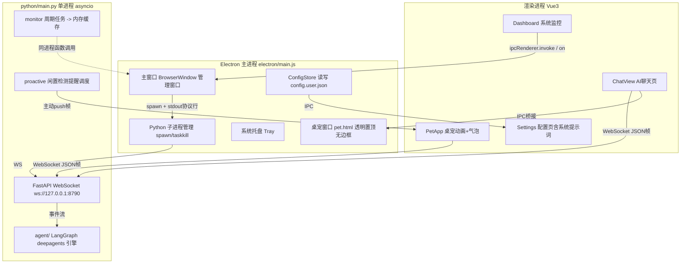
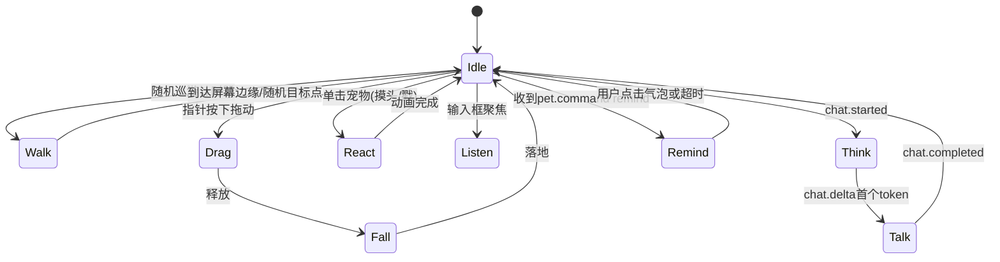

# 臭屁猫（Sassy Cat）桌宠 —— 总体详细设计

> 版本：v1.1（设计稿，已并入"系统提示词用户可编辑"需求）
> 技术栈：Electron 28 + Vue 3 + Vite（多页）+ Python 3.11（LangChain/deepagents）
> 已确认决策：FastAPI+uvicorn | 帧动画 spritesheet | Python 单进程合并 | 聊天双入口（主窗口页 + 桌宠气泡）| 系统提示词设置页可编辑

---

## 1. 总体架构

### 1.1 进程与通信拓扑



### 1.2 通信通道划分（回答你的设想 1、2、3）

| 数据类型 | 通道 | 说明 |
|---|---|---|
| 轮询/推送类监控数据（metrics/sysinfo） | **stdio 协议行 + IPC**（复用现有方案） | 已有实现，后续同类功能（如电量、网络状态）直接在 `monitor/` 加 collector，向协议 payload 加字段即可 |
| 配置持久化（LLM base_url / api_key / model / extra_params、系统提示词、桌宠偏好） | **config.json + IPC**（不入库） | 见第 3 节双层配置设计 |
| AI 对话、流式 token、主动提醒、未来的语音音频流 | **WebSocket**（渲染进程直连 Python，不经主进程转发） | 见第 4 节；WS 优于 SSE：双向、可重连、桌宠可被服务端 push |
| 窗口控制（拖动、置顶、鼠标穿透区域、显示隐藏） | **IPC** | 见第 5 节 |

> **关键设计点：WS 由渲染进程直连，主进程只负责拉起 Python 进程并广播 `agent-ready`（携带端口）。** 这样 token 流不经过主进程中转，延迟低、代码少。窗口间消息同步用服务端 session 房间 fan-out（第 4.5 节）。

### 1.3 Python 单进程模型改造

现在 `monitor/service.py` 是阻塞 while 循环。改造为：

```
python/main.py
 └─ asyncio.run(app.lifespan)                 # FastAPI + uvicorn 同事件循环
     ├─ task: monitor_loop()                  # 采集周期任务（to_thread 包 psutil 阻塞调用）
     │    ├─ 结果写 latest_metrics 内存缓存
     │    └─ 仍按行打印 __PROTOCOL__ 到 stdout（兼容现有 Electron 解析，二者共存）
     ├─ WS  /ws/agent                          # 聊天 + 事件
     ├─ GET /health                            # 供 Electron 探活/就绪检测
     └─ task: proactive_scheduler()            # 闲置提醒规则引擎（第 6 节）
```

- monitor 采集放进 `asyncio.to_thread`，不阻塞事件循环。
- `__PROTOCOL__` stdout 通道**保留不动**：Electron 现有解析逻辑零改动，Dashboard 继续走 IPC。未来 WS 稳定后可平滑迁移，本期不动它。
- 就绪信号：Python 启动完成后打印 `[READY] {"port": 8790}`，Electron `handleOutput` 识别后置 `agentReady` 并通过 IPC 广播（替代现在脆弱的"服务启动成功"字符串匹配，保留旧逻辑兼容）。

---

## 2. 目录结构规划（新增/调整）

```
sassy-cat/
├─ electron/
│  ├─ main.js                 # 增加：桌宠窗口、广播总线、config IPC
│  ├─ preload.js              # 增加：config API、bus API、pet 控制 API
│  └─ config-store.js         # 新增：双层配置读写 + 深度合并 + 原子写
├─ src/                       # 主窗口渲染进程
│  ├─ views/ChatView.vue      # 新增：完整聊天页
│  ├─ views/Settings.vue      # 新增：LLM 配置 + 系统提示词编辑页（侧边栏"设置"解除 disabled）
│  ├─ composables/useAgentSocket.js   # 新增：WS 客户端（单例+重连）
│  └─ composables/useConfig.js        # 新增：配置读写封装
├─ pet/                       # 新增：桌宠窗口（Vite 多页第二个入口）
│  ├─ pet.html
│  ├─ pet-main.js
│  └─ components/PetApp.vue   # 精灵动画 + 气泡 + 快捷输入
├─ assets/pet/                # 新增：spritesheet PNG + frames 配置
│  ├─ cat-idle.png / cat-walk.png / cat-react.png ...
│  └─ animations.json
├─ python/
│  ├─ main.py                 # 改为 asyncio + FastAPI 入口
│  ├─ server/                 # 新增：WS 服务层
│  │  ├─ app.py               # FastAPI 实例、路由、lifespan
│  │  ├─ ws_agent.py          # /ws/agent 端点、会话管理
│  │  ├─ protocol.py          # WS 消息 pydantic 模型定义
│  │  └─ bus.py               # 服务端事件总线（proactive -> 订阅连接）
│  ├─ agent/                  # 现有 demo 整理为引擎模块
│  │  ├─ engine.py            # agent 构建（配置注入版，替代 llms.py 读 env）
│  │  ├─ llms.py              # 改为工厂：build_chat_llm(cfg)
│  │  ├─ prompts.py           # 新增：默认人设模板 + 运行时骨架提示词拼接
│  │  ├─ main_agent.py        # 保留流式消费逻辑，封装成 run_agent_stream()
│  │  └─ builtin_tools.py
│  ├─ proactive/              # 新增：主动提醒规则引擎
│  │  └─ scheduler.py
│  └─ monitor/                # 基本不动，service.run() 拆出 collect_once()
├─ config/config.user.json    # 运行时用户配置（gitignore）
└─ vite.config.js             # input 增加 pet 入口
```

---

## 3. 配置系统设计（设想 2）

### 3.1 双层存储：模板 + 用户覆盖

`config.json` 在打包时通过 `extraResources` 进入 `resources/`，**只读、作为默认模板**（安装包升级会覆盖它，不能存用户数据）。新增用户配置文件：

| 层 | 路径 | 性质 |
|---|---|---|
| 模板层 | `resources/config.json`（现有） | 只读默认值，随应用发布 |
| 用户层 | `app.getPath('userData')/config.user.json` | 可写，存全部用户配置，升级不丢失 |

主进程 `config-store.js` 启动时深度合并两层，对外只暴露合并视图；写入只落用户层（原子写：先写 `.tmp` 再 rename）。

### 3.2 config.user.json Schema

```json
{
  "llm": {
    "activeProfile": "default",
    "profiles": {
      "default": {
        "label": "本地Qwen",
        "baseUrl": "http://localhost:8080/v1",
        "apiKey": "sk-xxx",
        "model": "Qwen3.6-35B",
        "extraParams": { "max_completion_tokens": 131072, "temperature": 0.7 }
      }
    }
  },
  "agent": {
    "persona": "你是「臭屁猫」，一只傲娇但可靠的桌面猫咪助手……（用户在设置页编辑的人设提示词）",
    "personaReset": false,
    "skillsEnabled": true,
    "maxToolRounds": 10
  },
  "pet": {
    "enabled": true, "position": { "x": 1200, "y": 780 },
    "scale": 1.0, "alwaysOnTop": true,
    "idleReminder": { "enabled": true, "thresholdMinutes": 30, "quietPeriodMinutes": 10 }
  },
  "voice": { "enabled": false, "asrProvider": "xfyun", "ttsProvider": "edge-tts", "credentials": {} },
  "server": { "wsPort": 8790, "host": "127.0.0.1" }
}
```

- `llm.profiles` 支持多套 LLM 配置切换（为将来换模型/多供应商留口）。
- `apiKey` 一期明文存 userData（本地桌面应用可接受）；预留升级路径：改用 Electron `safeStorage` 加密后存同一文件（字段值加 `enc:` 前缀标识）。
- 环境变量（现有 `LLM_BASE_URL` 等）作为**最低优先级 fallback**，方便开发调试。

### 3.3 传递链路：配置如何到达 Python

```
Settings页面 → IPC config:set → 主进程写 config.user.json
            → 主进程通知 Python 配置已变更（见 3.5.3 热更新）
            → Python 侧动态重建 agent / LLM 实例
```

- Python 启动参数：`python main.py --config <userData>/config.user.json`。
- Python 侧 `agent/llms.py` 重构为 `build_chat_llm(profile_cfg) -> ChatOpenAI` 工厂函数。
- `pet.position`、`pet.alwaysOnTop` 这类纯 UI 配置由主进程直接消费，不经过 Python。

### 3.4 新增 IPC 通道

| 通道 | 方向 | 载荷 |
|---|---|---|
| `config:get` | invoke → 主 | `{}`，返回合并后全量配置（apiKey 返回时掩码 `sk-***abc`） |
| `config:set` | invoke → 主 | `{ path: "llm.profiles.default.baseUrl", value }`，按点路径局部更新 |
| `config:changed` | 主 → 各窗口 on | 变更 diff，UI 响应式刷新 |
| `agent:restart` | invoke → 主 | 兜底方案：整体重启 Python 使新配置生效 |

### 3.5 人设 / 系统提示词设计（本次补充需求）

系统提示词与模型基础参数同级，用户在设置页编辑、持久化到 `config.user.json` 的 `agent.persona`，即时热生效。

#### 3.5.1 两段式提示词（防破坏设计）

直接把完整 system prompt 暴露给用户编辑，会导致用户误删工具调用/安全约束等结构性指令，Agent 行为异常。因此运行时提示词由**两段拼接**：

```
最终 system_prompt = USER_PERSONA（用户可编辑的人设段）
                   + RUNTIME_SKELETON（应用内置，不可编辑）
```

- **USER_PERSONA**：桌宠性格、称呼、语气、回复风格（"傲娇本喵"）。默认值内置在 `python/agent/prompts.py` 的 `DEFAULT_PERSONA`；用户编辑后存 `agent.persona`。
- **RUNTIME_SKELETON**：工具使用规范、输出格式约束、安全边界（高危操作需确认等），随应用版本演进，用户不可见亦可（设置页提供"查看运行时约束"只读折叠区）。
- 支持少量**模板变量**：`{app_name}`、`{time}`、`{os_user}`、`{pet_mood}`，渲染时替换，让人设可引用动态上下文。

#### 3.5.2 Settings 页面交互

"设置"页分两个卡片组：

1. **模型连接**：profile 下拉切换 + baseUrl / apiKey（掩码输入，可显隐）/ model / extraParams（JSON textarea + 实时校验）+ "测试连接"按钮（经 WS 发 `llm.test`，服务端发一次 hello 请求返回延迟/错误）。
2. **人设与行为**：
   - 大 textarea 编辑 `agent.persona`（等宽字体、字数统计、Markdown 预览可后置）；
   - 按钮【恢复默认】→ 清空 `agent.persona` 回落到 `DEFAULT_PERSONA`；
   - 按钮【预览完整提示词】→ 经 WS `prompt.preview` 拉取服务端拼接+变量渲染后的最终 system_prompt（只读，所见即所得）；
   - 保存后经 `config:set` 写入并触发热更新，成功回执 toast"人设已生效"。

#### 3.5.3 热生效机制

`create_deep_agent(system_prompt=...)` 在构图时固定提示词，改配置须重建 agent，但代价可控：

- checkpointer（sqlite）按 thread_id 持久化，**重建图不影响历史会话**；
- Python 侧维护 `AgentHolder` 单例：`{ version, agent }`。收到 `config.invalidate`（WS 控制帧或由主进程经 stdio 发一行 `__CONFIG__ <path>` 协议）→ 加锁重建 → `version++`；进行中的流式回复用旧实例跑完，下一轮消息自动用新实例；
- LLM 参数（baseUrl/model/key）变更走同一条 `AgentHolder` 重建路径，一期也可退化为 `agent:restart` 整体重启（实现最简单，M2 先用重启，M3 后升级为热重建）。

---

## 4. AI Agent WebSocket 服务设计（设想 3）

### 4.1 端点与连接

- `ws://127.0.0.1:8790/ws/agent?client=pet|main&sessionId=xxx`
- 仅绑定 `127.0.0.1`，不加鉴权（本机回环）；`client` 参数用于服务端区分来源做定向推送。
- 多连接共存：桌宠与主窗口各自一条连接，通过 `sessionId` 归属同一**会话房间**，实现两处 UI 消息同步（见 4.5）。

### 4.2 消息协议（JSON 帧，统一信封）

```json
{ "v": 1, "id": "c-8f3a", "ts": 1730000000000, "type": "chat.send", "payload": { } }
```

**Client → Server**

| type | payload | 说明 |
|---|---|---|
| `chat.send` | `{ sessionId, content, attachments? }` | 发起一轮对话 |
| `chat.cancel` | `{ sessionId, msgId }` | 中断当前生成（服务端调 langgraph cancel） |
| `chat.history` | `{ sessionId, limit, before? }` | 拉历史（一期可从 sqlite checkpointer 恢复） |
| `session.new` | `{}` | 新会话，返回新 sessionId |
| `tool.confirm` | `{ callId, approved }` | 高危工具（write_file 等 interrupt）确认回传 |
| `prompt.preview` | `{ persona }` | 返回拼接+渲染后的完整 system_prompt（设置页预览用） |
| `llm.test` | `{ profileName }` | 用指定配置发一次探测请求，返回连通性/延迟 |
| `config.invalidate` | `{ paths }` | 通知服务端重建 AgentHolder（配置热生效，见 3.5.3） |
| `client.event` | `{ name, data }` | 通用上行事件：`user_activity`（电源活动）、`pet.action.done` 等 |
| `ping` | `{}` | 心跳，10s |

**Server → Client**

| type | payload | 说明 |
|---|---|---|
| `chat.started` | `{ msgId, sessionId }` | 本轮开始 |
| `chat.delta` | `{ msgId, text }` | 流式 token 增量 |
| `chat.completed` | `{ msgId, text, usage? }` | 结束（含最终全文，容错拼接） |
| `chat.error` | `{ msgId, code, message }` | LLM 调用失败等 |
| `agent.tool_call` | `{ name, args, phase: start\|end, status }` | 工具执行状态（UI 显示"本喵在查天气…"） |
| `agent.interrupt` | `{ callId, tool, args }` | 等待 tool.confirm |
| `pet.command` | `{ action, durationMs?, text? }` | **服务端驱动桌宠动画**：`remind`/`wave`/`think`/`sleep`，text 为气泡文案 |
| `proactive.message` | `{ msgId, text, urgency }` | 主动提醒文案（如"为什么不理本喵"） |
| `metrics.snapshot` | 同现有 metrics | 二期可将 Dashboard 迁到 WS |
| `pong` / `error` | — | 心跳应答 / 协议错误 |

### 4.3 流式桥接：langgraph → WS

`agent/main_agent.py` 的 demo 消费逻辑封装为异步生成器（`agent.stream` 在独立线程跑，经 `janus`/`asyncio.run_coroutine_threadsafe` 桥回事件循环），逐 delta `send_json` 到房间内所有连接。帧级节流：≥50ms 或 ≥80 字符合并一帧，避免小帧风暴。

### 4.4 客户端与重连（`useAgentSocket.js` 单例）

- **状态机**：`connecting → open → (close|error) → reconnecting(指数退避 1s,2s,4s…max 30s) → open`。
- 离线消息队列：未连接时 `chat.send` 入队，`open` 后冲刷；UI 顶栏显示连接状态点（复用 App.vue 的 sidebar-footer "未连接"）。
- 浏览器原生 WebSocket 无鉴权需求，重连后服务端按 `sessionId` 恢复上下文（langgraph thread 天然持久）。
- Python 进程重启由主进程 watchdog 负责（`exit` 事件 → 延迟重启 ≤3 次），前端只需应对 WS close。

### 4.5 跨窗口会话同步

主窗口 ChatView 与桌宠可能同时在线。方案：**两个 WS 连接各自独立，但共享 `sessionId`；服务端按房间 fan-out**（同一 session 的 `chat.delta` 推给房间内所有连接）。这样两处 UI 天然一致，Electron 主进程无需转发聊天流量。Electron 主进程仅新增一个通用 `bus:emit/bus:on` IPC 用于非聊天类 UI 协调（如"主窗口正在输入→桌宠切换到 listen 动画"）。

---

## 5. 桌宠窗口与动画设计

### 5.1 窗口参数（Electron）

```js
petWindow = new BrowserWindow({
  width: 220, height: 260,           // 精灵 + 气泡留白
  frame: false, transparent: true, resizable: false,
  alwaysOnTop: true, skipTaskbar: true,
  hasShadow: false, focusable: true,
  webPreferences: { preload: pet-preload.js, contextIsolation: true }
})
petWindow.setIgnoreMouseEvents(true, { forward: true }) // 默认穿透
```

- **鼠标穿透策略**：桌宠精灵区域用 DOM `mousemove` 命中检测——指针进入宠物 bounding box 时 IPC `pet:set-interactive {true}` 关闭穿透，离开后恢复穿透，不挡用户操作桌面其他区域。
- 位置持久化到 `pet.position`，多显示器按 `screen.getDisplayMatching` 校验越界回收。
- 显示/隐藏挂到托盘菜单"显示桌宠"。

### 5.2 动画状态机（spritesheet 帧动画）

`animations.json` 描述每段动画：`{ name, sheet, frameWidth, frameHeight, fps, loop }`。渲染用单 `<div>` + `steps()` 逐帧位移（CSS animation），零 canvas 依赖。



**Drag 移动实现**：渲染层 `mousedown` 记录偏移 → `mousemove` 中 IPC `pet:move {x,y}`（主进程 `setPosition`，主进程 16ms 节流合并）。不用 CSS `-webkit-app-region: drag`，因为它吞掉 click 事件，无法做点击互动。

### 5.3 交互行为映射

| 交互 | 动画 | 反馈 |
|---|---|---|
| 单击 | React（撒娇/被戳）+ 随机文案气泡 | 纯前端文案池，30% 概率触发 |
| 双击 | 打开/聚焦主窗口聊天页（IPC `main:show-chat`） | |
| 长按/拖拽 | Drag 移动，落地 Dust 特效 | |
| 右键 | 弹出精简菜单（聊天/暂停动效/隐藏） | 用 IPC 让主进程弹原生 Menu |
| AI 回复中 | Think→Talk，气泡流式打字机展示 delta | 与主窗口内容同步（同 session fan-out） |

### 5.4 资产规范

一期用 4 张占位 spritesheet 跑通管线：`idle(8帧) walk(6帧) react(6帧) sleep(4帧)`，128×128/帧，后续可整体替换为美术稿或升级 Lottie（渲染层接口 `play(name): Promise` 不变）。

---

## 6. 闲置检测与主动提醒设计

**判定源放 Python 侧**（规则引擎与未来 Agent 决策同源），Electron 只做"活动信号上报器"。

### 6.1 数据流

```
Electron 主进程: powerMonitor.on('user-active' | lock | resume)
        │ 活动心跳 30s/次
        ▼ ws 帧 client.event {name:'user_activity', source:'powerMonitor'}
        │（Electron 主进程自持一条轻量 WS 连接，或由桌宠渲染层转发——一期用主进程直连，
        │ Node 原生 ws 客户端仅几十行，避免依赖桌宠窗口存活）
Python proactive/scheduler.py
  ├─ last_active_ts（活动心跳刷新）
  ├─ 双阈值规则：
  │    idle >= threshold(30min) 且距上次提醒 >= quiet(10min)
  │    → 随机/模板/LLM 生成文案 → bus.publish pet.command+proactive.message
  ├─ 会话冷却：若用户正在 chat（active session 有流）→ 跳过
  └─ 屏幕锁定/息屏（powerMonitor 转发 lock-screen 事件）→ 暂停计时
```

一期实现 Electron `powerMonitor` 的 OS 级空闲即可（覆盖"为什么不理本喵"场景）。更细粒度的"对某窗口的输入空闲"需要 native 模块（robotjs / Win32 API via ffi），**明确不做**，留到语音模式阶段统一评估。

### 6.2 提醒文案生成

- 一期：模板池随机（"为什么不理本喵😾""喵～你 Are you still there?""再不理我我就睡着了💤"），零成本、离线可用。
- 二期：接 LLM 按人设生成（读取 `agent.persona` 保持语气一致），带当日上下文（时间、监控异常等）。
- 可扩展触发器：CPU 持续 >90%、整点报时、久坐提醒——同一 `Trigger` 接口注册进 scheduler。

---

## 7. 聊天 UI 设计

### 7.1 主窗口 ChatView.vue（`#/chat` 路由，侧边栏新增"AI 聊天"）

- 布局：左会话列表（新建/重命名/删除，一期可只留单会话）+ 右消息流。
- 消息渲染：markdown-it + highlight.js；工具调用显示为折叠步骤条（`agent.tool_call` 事件驱动）；`interrupt` 时内联"允许/拒绝"按钮。
- 输入区：多行输入、Enter 发送 / Shift+Enter 换行、生成中变"停止生成"按钮（`chat.cancel`）。
- 状态：连接指示、错误重试、历史翻页（`chat.history`）。

### 7.2 桌宠气泡

- 宠物头顶绝对定位气泡：最大宽 200px、打字机流式显示 `chat.delta`、超长截断 + "打开聊天"按钮跳主窗口。
- 快捷输入：点击气泡展开 mini 输入框（petWindow 临时增高 220→320），提交走同一 `useAgentSocket`。

### 7.3 会话持久化

一期复用 langgraph `SqliteSaver`（thread_id = sessionId）作为唯一事实源；UI 历史经 `chat.history` 从 checkpointer 读取转换。不另建 messages 表，避免双写。

---

## 8. 未来：语音对话模式（预留接口，不实现）

- 管线：`麦克风采集(渲染层 getUserMedia/WebAudio) → 分帧 WS binary 帧 → Python ASR(可插拔 provider) → Agent → TTS → 音频流 binary 帧 → 渲染层播放`。
- WS 协议预留：`type:'audio.chunk'`（binary，首帧带 JSON header：`{ codec:'opus|pcm16', sampleRate }`）、`voice.mode: on|off`、`voice.state`（listening/thinking/speaking，驱动桌宠 Talk 口型动画）。
- 唤醒词/VAD 放渲染层（`silero-vad` wasm 或能量阈值起步）。
- `config.user.json` 的 `voice` 段与 provider 工厂签名先行定义，模型接入（如 edge-tts、讯飞、本地 whisper.cpp）实现为 `server/providers/{asr,tts}/*.py` 插件。

---

## 9. 实施阶段拆分（里程碑）

| 阶段 | 内容 | 验收 |
|---|---|---|
| M1 后端骨架 | Python 改 asyncio+FastAPI，monitor 并入周期任务，`/health` + `[READY]` 信号，requirements 增加 fastapi/uvicorn/janus | Electron 拉起后 health 探活成功，Dashboard 不回归 |
| M2 配置系统 | config-store.js、Settings 页面（模型连接 + 人设/系统提示词编辑、预览、恢复默认）、IPC config:*、llms.py 工厂化、prompts.py 两段拼接、配置变更触发 agent 重启 | 改 base_url/model/提示词后问答立即按新配置走，预览显示最终拼接提示词 |
| M3 WS 聊天 | ws_agent 端点、消息协议（含 prompt.preview/llm.test/config.invalidate）、useAgentSocket、ChatView 流式对话 + 工具状态展示、AgentHolder 热重建 | 主窗口完成 Q/A 流式聊天、中断/取消可用、改人设不重启即生效 |
| M4 桌宠窗口 | pet.html 多页入口、透明置顶窗口、鼠标穿透切换、拖动、spritesheet 状态机、点击互动 | 桌宠常驻桌面，可拖、可戳、有动画 |
| M5 桌宠×AI 联动 | 气泡打字机、快捷输入、session 房间同步、pet.command 动画驱动 | 主窗口和桌宠同步显示同一会话回复 |
| M6 主动提醒 | powerMonitor 活动上报、proactive scheduler、提醒文案与动画 | 空闲 30min 桌宠跳出"为什么不理本喵" |
| M7 打磨 | 托盘菜单扩展、开机自启、多显示器、异常恢复（Python crash 重启）、性能 | 打包后 7×24 稳定 |
| M8(未来) 语音 | ASR/TTS provider 插件、audio 帧、VAD | 另立设计稿 |

**依赖关系**：M1→M2→M3 串行；M4 可与 M2/M3 并行；M5 依赖 M3+M4；M6 依赖 M5。

---

## 10. 风险与对策

| 风险 | 对策 |
|---|---|
| 透明窗口在部分 Windows 显卡驱动下闪烁/黑块 | 备开关 `pet.transparentFallback`：退化为不透明小窗贴屏幕角落 |
| agent.stream 阻塞事件循环 | 图执行跑独立线程 + janus 队列桥接；超时 maxToolRounds 限制 |
| 用户编辑系统提示词破坏结构指令 | 两段式提示词（3.5.1）：人设段可编辑，运行时约束段内置不可改；预览所见即所得 |
| 提示词热重建竞态 | AgentHolder 读写锁：进行中流用旧实例跑完，新一轮取新实例 |
| WS 与 stdio 双通道数据重复 | 明确分工：监控走 stdio/IPC，对话走 WS，互不交叉 |
| apiKey 明文 | 一期接受（本机文件）；预留 safeStorage 加密升级位 |
| 帧动画资源缺 | 先用程序生成的占位图（SVG 导 PNG），管线优先 |
